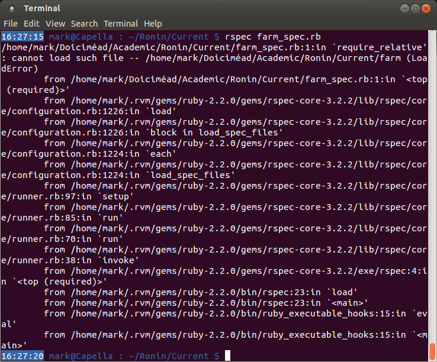
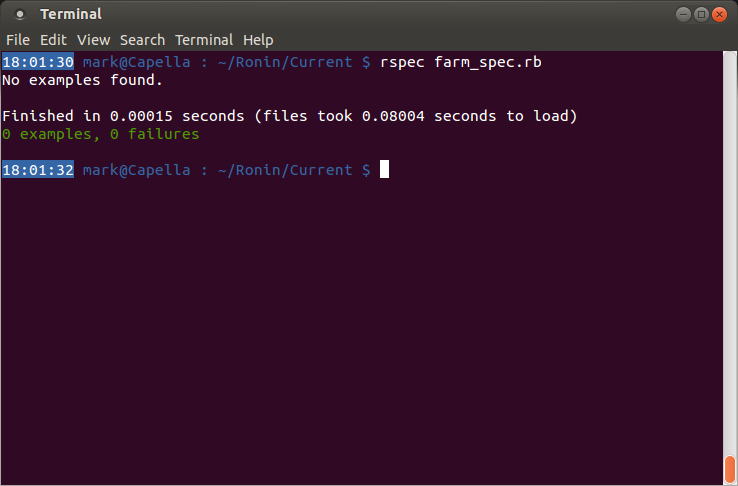

####Setting up the test file – Step 1####
The first step is to create the test file. Normally this will be of the form `classname_spec.rb`, though you can specify whichever name you like. If there are going to be a lot of test files, Ruby code files, or you just want to keep them separate, you can put the file in a subdirectory. The only stipulation is that the test file references your code so that it knows where to apply the tests. So let’s start off by creating a new file called `farm_spec.rb` in your project directory:

```bash
touch farm_spec.rb
```

Using your text editor (Atom, Gedit, Sublime, nano, or, if you’re nuts, vi) open the file and create a reference to our code file (it doesn’t exist yet, but we can make the reference anyway). This will differ depending on the version of Ruby you are using:

```ruby
require 'farm' # Ruby < 1.9.2
require_relative 'farm' # Ruby >= 1.9.2
```

Now run the (very limited) test suite from the terminal:

```bash
rspec farm_spec.rb
```



Well, that doesn’t look good! What happened there? Well, at the very top of the output is a single line:

```
/home/mark/Doiciméad/Academic/Ronin/Current/farm_spec.rb:1:in `require_relative':
cannot load such file -- /home/mark/Doiciméad/Academic/Ronin/Current/farm (LoadError)
```

This is telling you that in line 1 of the `farm_spec.rb` file, there is a Ruby command `require_relative` that failed to execute correctly. Why? Well, it `cannot load such file` called `farm`. This makes sense because we haven’t created it yet. The rest of the output is known as a ‘stack trace’ and outlines all the method calls in all the classes that were running when the `LoadError` occurred. This is not useful to us for this tutorial, but stack traces will be useful for finding errors in your code in future projects, so it is good to know.

So let’s fix this error by creating the `farm.rb` file:

```bash
touch farm.rb
```

and run `rspec` again:

```bash
rspec farm_spec.rb
```



Better! Or is it? It looks like all tests have passed, so can we go home now? Not yet: the output tells us `no examples found`. That’s because there are no tests to perform – we haven’t written them yet!

[← A little preamble – Step 0](./writing_tests_preamble.md)

[Writing the first test – Step 2 →](./writing_tests_step2.md)
