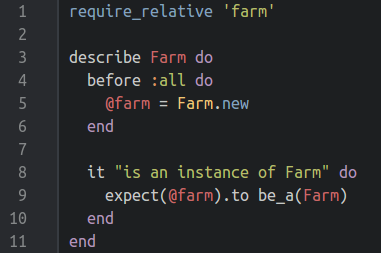
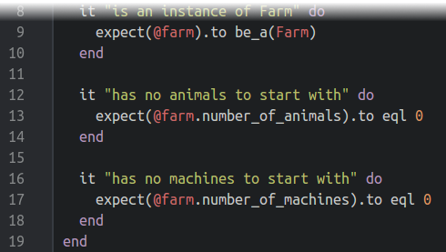
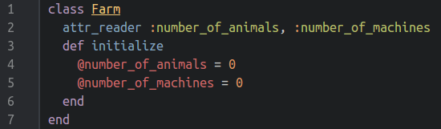

####Expanding the Farm tests – Step 3####
Going back to Step 0 again, we mentioned that we would like to keep track of the numbers of animals and machines on the farm. If you can’t remember that, it was where I mentioned the cow tucked under a person’s arm…

…now you remember – good! So let’s go ahead and test for that…

…well, see that’s not so easy – other than the explicit instance of Farm we create to test that Farms can exist as Farms, we have no way of accessing the new Farm to test it further. We could always create a new Farm object for each test, but then we’re not testing the contents of the same Farm each time. Thus we need to tweak the test file a little first.

Now, instead of creating the Farm object inside the test expression, the `before :all` creates a single object for us before any of the tests are run. We can hand this to a variable `@farm` which can then be referenced in the tests. The test string has also been updated to reflect the changes in the test expression.

Had we wanted to create a new Farm object for each test, we could’ve used `before :each` instead of `before :all`.

Now that we have a reference to a Farm object, we can write tests to check the number of animals and machines on that Farm:

It should be fairly straight-forward to see what is going on: we are running a test to see if `@farm`’s instance variables `number_of_animals` and `number_of_machines` are initialised to zero. Running `rspec` gives:

As we can see two tests were performed, both of which failed with a `NoMethodError`. Not only that, but the tests also reveal what the expected value was: 0. So let’s fix that and try again:

Perfect!

[← Writing the first test – Step 2](./writing_tests_step2.md)

[Adding Animals – Step 4 →](./writing_tests_step4.md)
