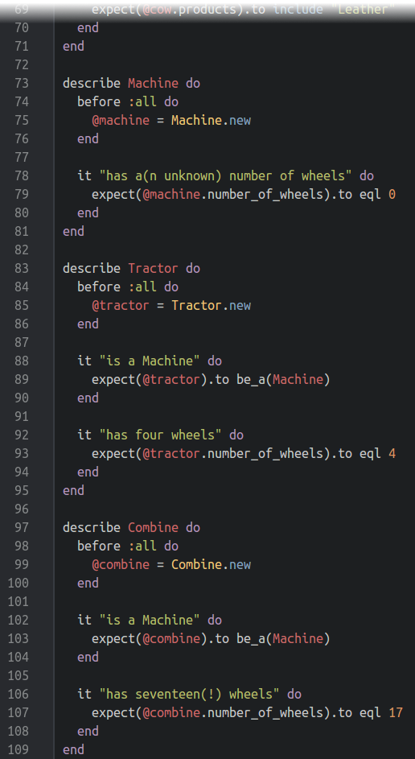
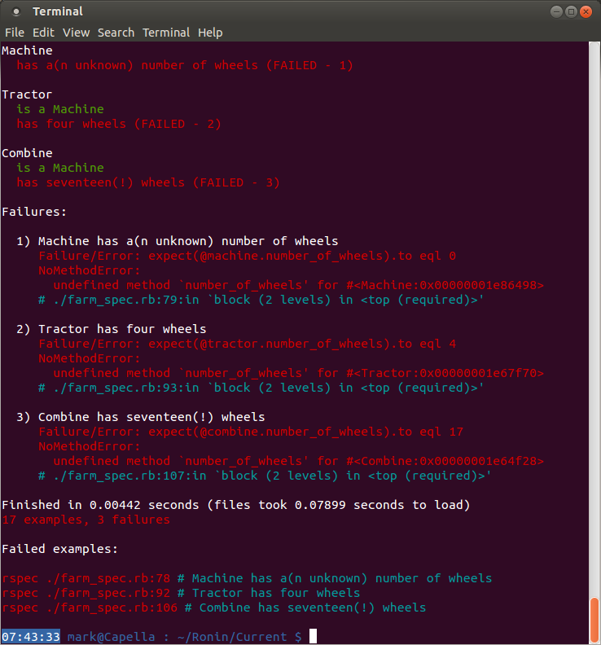
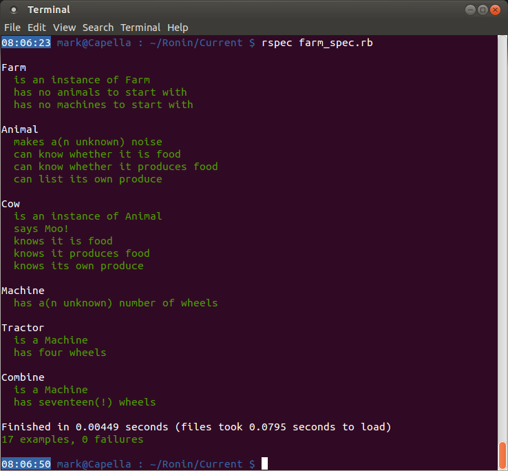

####Machinery makes the Farm complete – Step 6####
We almost have a complete, working Farm now. All we need to do is add some machinery. From the critera in Step 0:
- farmyard machines, which:
  - have a certain number of wheels

This should give you enough information already to write your own tests. Use the tests you’ve already written for the Animal and Cow classes (and any others you wrote in Step 5) to test these Machines. Remember to test for a generic Machine, and then add some more specific Machines (at least add a Tractor, it’s not a Farm without a Tractor!).

Again, try to make the tests pass by yourself before looking at the solution.

So that’s it, isn’t it? All tests passed! Well, not quite. We have inadvertently broken one of our first tests without realising it…

[← Extending Animals – Step 5](./writing_tests_step5.md)
