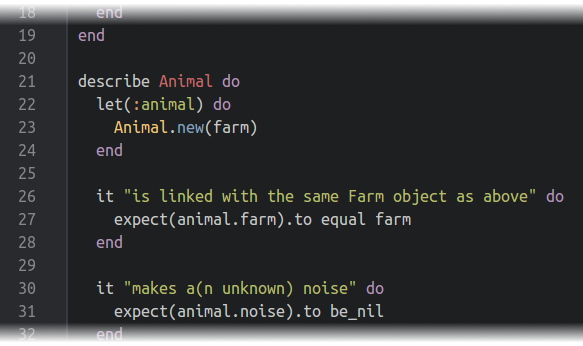
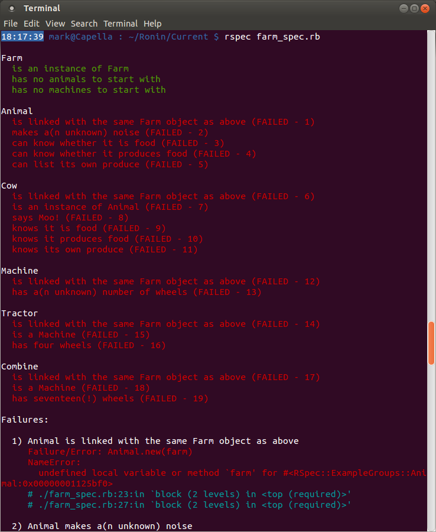
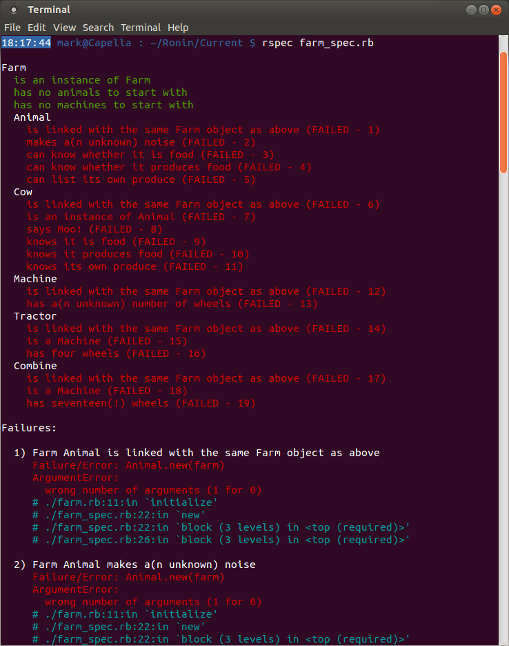
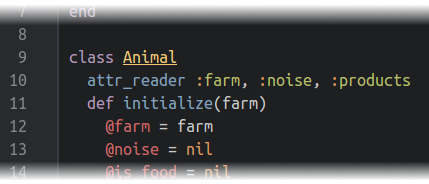
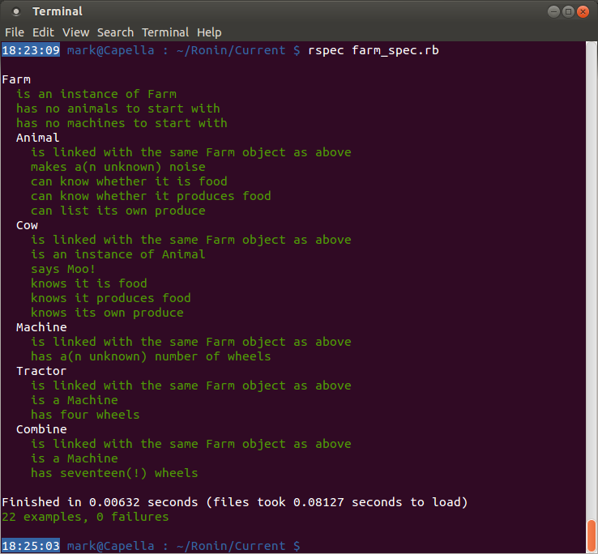
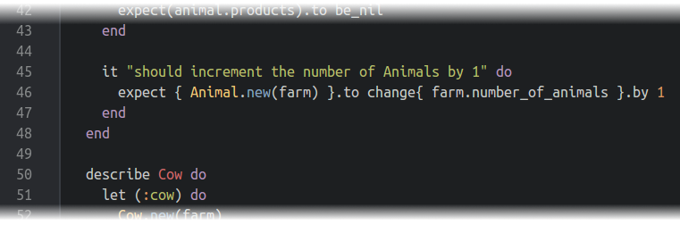

####Tying up loose ends – Step 7####
So we have a Farm containing Animals and Machines…or do we? At the moment all we have is a collection of Animals and Machines that happen to have been produced along with a Farm – there is nothing connecting them together. What we actually want is the Farm to contain the Animals and Machines; or even better, to associate the Animals and Machines with a Farm when they are created. This way it opens up the possibility for the Animals and Machines to move to a different Farm later on if needed/wanted.



(Although only the Animal tests are shown here, don’t forget to add something similar to _each_ class being tested, subclasses too!)

So why `equal` instead of `eql` like before? Well, in this case we want to make sure the two Farms are _exactly_ the same object. Not identical, not mostly equivalent; _exactly_. `eql`, in most circumstances, will only test equivalency, which is usually what we want, but in this case it’s not precise enough; hence `equal`.



```
NameError: undefined local variable or method `farm'
```

Hmm, so what’s happened? Well, the variable `farm` has is being referenced beyond its scope. When the `end` statement associated with `describe Farm` on line 19 was reached, `farm` was destroyed as it was only created as a local variable. This is where the `before :all` statement potentially wins over `let`. There are two things we can do to fix this: rewrite all the `let` statements to `before :all` (remembering to change all references to `farm`, `animal`, etc. to `@farm`, `@animal`, and so on), or we can nest all the other class tests inside `describe Farm` and run the test suite again. The latter is much easier to do at this stage:



You can now fix this by adding code similar to that below to your `initialize` methods:





There is still one thing missing, however. Remember we talked about keeping track of numbers? No? You don’t remember the cow under the arm? Well, let’s test for it anyway. Add in a test that creates a new object within the class you are testing (Animal inside the Animal description, Cow inside the Cow description) and ensure that it increments the correct counter by 1 (i.e. `number_of_animals` in Animal classes, and `number_of_machines` in Machine classes).




OK, so those tests are at least seeing some numbers, but not the right ones. Have a go at fixing that:


Congratulations! You have built up a working farmyard using RSpec tests to guide you. Have a cup of tea and experiment a bit more trying out new tests and new classes or methods to run them on. Have a look at the [online resources](../online_resources.md) for some further reading.

[← Machinery makes the Farm complete – Step 6](./writing_tests_step6.md)

[From Zero to Hero with RSpec →](../README.md)
