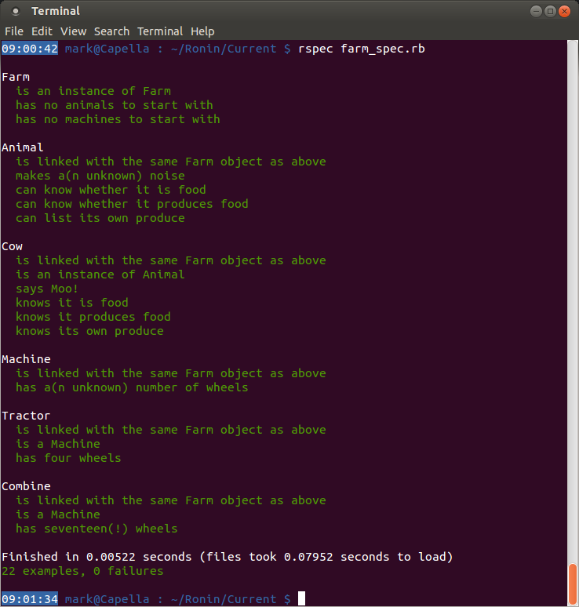

####Tying up loose ends – Step 7####
So we have a Farm containing Animals and Machines…or do we? At the moment all we have is a collection of Animals and Machines that happen to have been produced along with a Farm – there is nothing connecting them together. What we actually want is the Farm to contain the Animals and Machines; or even better, to associate the Animals and Machines with a Farm when they are created. This way it opens up the possibility for the Animals and Machines to move to a different Farm later on if needed/wanted.


(Although only the Animal tests are shown here, don’t forget to add something similar to _each_ class being tested, subclasses too!)

So why `equal` instead of `eql` like before? Well, in this case we want to make sure the two Farms are _exactly_ the same object. Not identical, not mostly equivalent; _exactly_. `eql`, in most circumstances, will only test equivalency, which is usually what we want, but in this case it’s not precise enough; hence `equal`.


You can fix this by adding code similar to that below to your `initialize` methods:




There is still one thing missing, however. Remember we talked about keeping track of numbers? No? You don’t remember the cow under the arm? Well, let’s test for it anyway. Remember to adjust the numbers for your own example if you’ve added extra Animals or Machines. Don’t forget to count the generic Animals/Machines you created too!


Oh dear:

```
undefined method `number_of_animals' for nil:NilClass
```

That’s not good. Why has `@farm` suddenly disappeared? Well, by creating a new `describe Farm` block, we’ve overwritten the old `@farm` variable with nothing. So this means that we now have to put the test inside the original `describe Farm` block, but after all the other tests we’ve written. How can we do that? Simple: nest them. Nest the other class tests and then add our new test to the end (note carefully how the indenting in the next shot differs from that above):


OK, so now the tests are at least seeing some numbers, but not the right ones. Have a go at fixing that.
