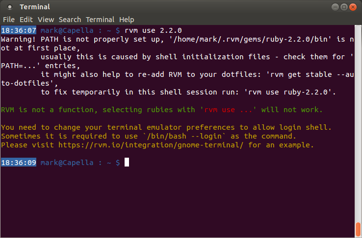

#From Zero to Standstill: Why am I Getting Cascading Errors?#

Aha! So you did what I did and decided to ignore the pre-course warnings about trying to do the course on GNU/Linux? Good! Here’s how to fix some of the main issues:

##My system hasn’t got a clue what version of RSpec I am running…##
####…(aka I am trying to run RSpec, and I am sure I have it installed, but “computer says no!”)####

This is probably due to having more than one version of RSpec installed. When I started the pre-course, I was a diligent fellow and installed all the various bits of Ruby I though I would need to complete the course from my package manager. The package manager was even good enough to give me two different versions of Ruby together, with a simple difference in command to run the version I wanted at the time. Brilliant!

Then I installed RVM in the first week, and then some gems used to perform some testing (`gem install bundler` ring any bells?), then I had issues…

It turns out the Ruby/RSpec versions installed by the package manager clash with those installed via RVM. The only way to solve this (that I found, unless you really want to go insane!) is to remove the package manager versions, and then patch the resulting holes by reinstalling the packages needed via RVM:

```bash
sudo apt-get remove ruby # Debian/Ubuntu/Mint only – obviously substitute your package manager command here, or use your GUI.
sudo apt-get autoremove # This will remove any dependencies left over too.

# Probably worth checking for updates to RVM at this point:
rvm get stable

# Now fix your Ruby installation!
rvm install 2.0.0 # The version of Ruby recommended at the beginning of the course.
rvm install ruby --latest # The latest version of Ruby, whatever that happens to be. Note the version number when it appears!
rvm --default use [version number from previous command]

# Then fix the other bits that have been hacked apart:
# Run any/all commands below that you have already run on the course so far:
rvm docs generate
gem install pry
gem install rspec
gem install bundler
```

##Help! Those commands don’t work – I am generating more errors!##
Don’t panic! Are you getting a message similar to this?



I am willing to bet you are using Ubuntu if this is the case. All that has happened is the files that were updated when RVM was installed (`~/.profile` and `~/.bash_profile`) are not being read from your shell when it is started. This has something to do with the shell running from within a graphical environment, and thus is not a login shell. To remedy, run the command:
```bash
. ~/.rvm/scripts/rvm # Yes, that *is* a dot followed by a space!
```
to activate RVM for the current shell session, and then simply add `[[ -s "$HOME/.rvm/scripts/rvm" ]] && source "$HOME/.rvm/scripts/rvm"` to your `~/.bashrc` file, which _is_ called by the shell when started ([AskUbuntu](http://askubuntu.com/questions/121073/why-bash-profile-is-not-getting-sourced-when-opening-a-terminal), [Greg’s Wiki](http://mywiki.wooledge.org/DotFiles)). If you’re lazy, you can just copy and paste the following into your terminal:

```bash
echo '[[ -s "$HOME/.rvm/scripts/rvm" ]] && source "$HOME/.rvm/scripts/rvm" # Load RVM into a shell session *as a function*' >> ~/.bashrc
```
