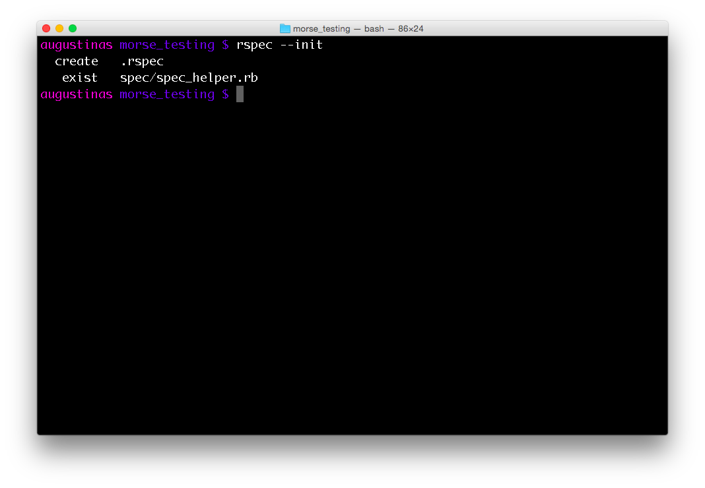
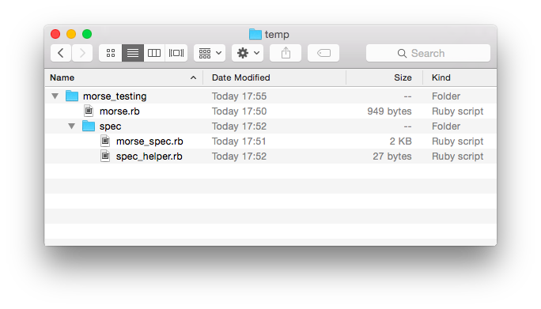

# Testing, Testing, 1, 2, 3... #
Friends or collegues keep on rumbling on how great TDD is? Want to learn more about the paradigm, but not sure how? There is no better way than getting your feet wet and diving straight into some code. By doing the following example you will get the first hand experience of adhering to test specifications and see how the whole process can accelerate code development. That means your current goal will be to write a program that can successfully pass those tests. That's all you need to do.

#### Step 0 - Let's Set Up Everything Right ####
There is a lot of different software packages available for the implemetiation of TDD. In this tutorial we are going to stick to the popular Ruby package - RSpec. Assuming Ruby and RVM is already installed on your system all there is to do is to run the following code in the terminal:
```bash
gem install rspec
```
Terminal will inform you that six new gems have been installed and that's us ready to go. There is a lot of RSpec parameters to tweak and improve the workflow, but we left that for [later](./more_info.md). Trouble installing? Check out our [troubleshooting tips](./other_issues.md). For those running on Linux, we have some additional [setup tips](./installation_issues.md).

Once we have installed successfully, let's set up a working environment for our small project. First, create project's folder:
```bash
mkdir morse_testing
cd morse_testing
```
Let's create our program file:
```bash
touch morse.rb
```
And then paste the following [code](https://raw.githubusercontent.com/augustinas/from-zero-to-hero-with-RSpec/master/code/morse.rb) into the newly created file.
Now let's create a new _spec_ directory and two more files inside of it:
```bash
mkdir spec
cd spec
touch morse_spec.rb
touch spec_helper.rb
```
Now let's put the following [code](https://raw.githubusercontent.com/augustinas/from-zero-to-hero-with-RSpec/master/code/morse_spec.rb) into the _morse_spec.rb_ file. This is where all of our pre-written tests will sit. Finally, open the _spec_helper.rb file, add the following statement, save and close.
```ruby
require_relative '../morse'
```
Almost there! The last thing we need to do is to tell RSpec that we want to create testing environment in our morse_testing folder:
```bash
rspec --init
```
Your terminal window should be saying something like that:

And you aim to have the following file structure at this stage:

For this first example we have prepared tests for you.

Now, let's start testing!

[----> Step 1](./morse_1.md)
