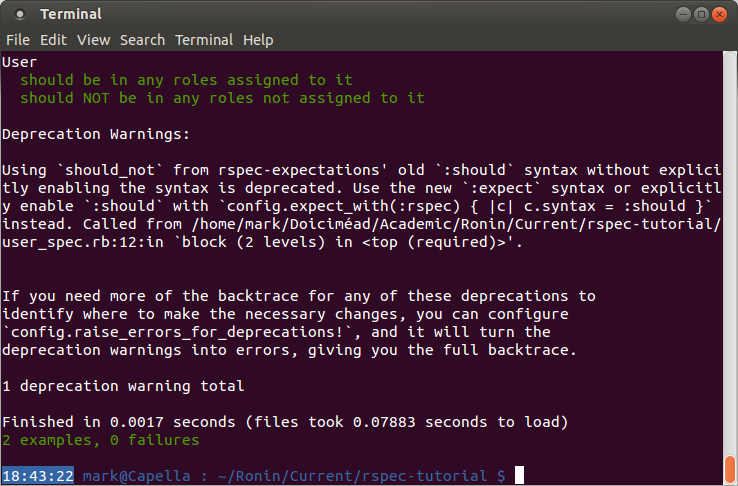

##I am getting deprecation warnings when I run RSpec – what have I broken now?##
Messages like this:

simply mean that the tests you are running are using an old syntax. If they’re your own tests, then you might want to consider updating them, otherwise there’s not much you can do. The warnings are not stopping the tests from performing correctly, so you can ignore them. If you really want to quieten them, you can follow the steps in [Relish – RSpec Expectations](https://relishapp.com/rspec/rspec-expectations/docs/syntax-configuration) (Myron Marsten outlines it in his [blog](http://rspec.info/blog/2012/06/rspecs-new-expectation-syntax/).)
