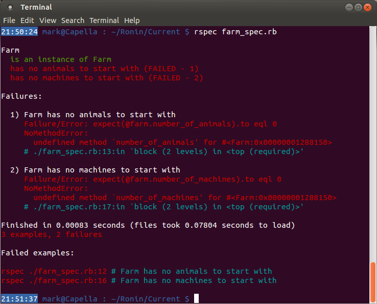
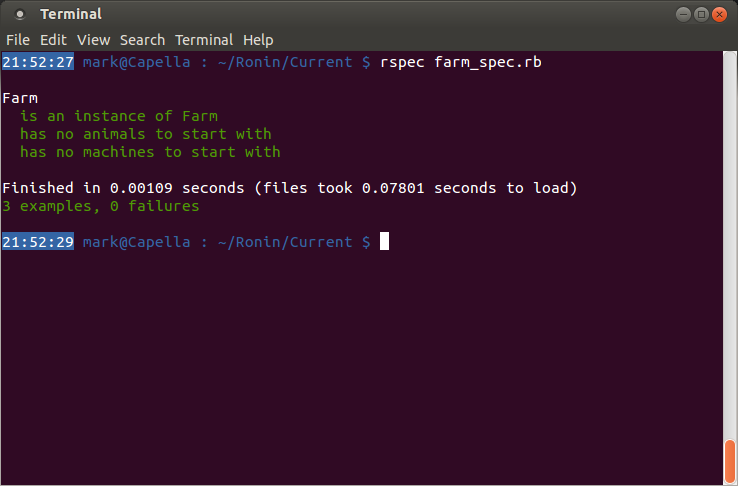

#From Zero to Writing Your Own Tests#
So, now you have some experience developing a programme that conforms to a given set of tests, but what happens if nobody has written the tests yet? Simple, write your own! How? Ahh…

####A little pre-testing setup – Step ‐1####
If you haven’t done so already, I really recommend setting up your RSpec configuration to give you a [colourised output and documentation format](./more_info.md) as these will greatly improve readability of our test responses.

####A little preamble – Step 0####
The next step is defining _what_ you want to test. This step is completed before you get anywhere near writing code. For this example, we are going to have:
- A farm that contains:
  - animals, which:
    - make a noise
    - declare whether they produce foodstuffs
    - declare whether they themselves are food
    - list the products they can make
  - farmyard machines, which:
    - have a certain number of wheels

It would also be wise to keep track of the number of animals and machines present on the farm, you know, so the police can be called if somebody’s lifted something…though I’m really struggling to picture a dudette/dude running down the road with a cow under their arm!

Admittedly this example will not produce code that is particularly intricate, but I want to focus more on building the test statements than the Ruby code itself. I will therefore keep the code relatively simple.

####Setting up the test file – Step 1####
The first step is to create the test file. Normally this will be of the form `classname_spec.rb`, though you can specify whichever name you like. If there are going to be a lot of test files, Ruby code files, or you just want to keep them separate, you can put the file in a subdirectory. The only stipulation is that the test file references your code so that it knows where to apply the tests. So let’s start off by creating a new file called `farm_spec.rb` in your project directory:

```bash
touch farm_spec.rb
```

Using your text editor (Atom, Gedit, Sublime, nano, or, if you’re nuts, vi) open the file and create a reference to our code file (it doesn’t exist yet, but we can make the reference anyway). This will differ depending on the version of Ruby you are using:

```ruby
require 'farm' # Ruby < 1.9.2
require_relative 'farm' # Ruby >= 1.9.2
```

Now run the (very limited) test suite from the terminal:

```bash
rspec farm_spec.rb
```


Well, that doesn’t look good! What happened there? Well, at the very top of the output is a single line:

```
/home/mark/Doiciméad/Academic/Ronin/Current/farm_spec.rb:1:in `require_relative':
cannot load such file -- /home/mark/Doiciméad/Academic/Ronin/Current/farm (LoadError)
```

This is telling you that in line 1 of the `farm_spec.rb` file, there is a Ruby command `require_relative` that failed to execute correctly. Why? Well, it `cannot load such file` called `farm`. This makes sense because we haven’t created it yet. The rest of the output is known as a ‘stack trace’ and outlines all the method calls in all the classes that were running when the `LoadError` occurred. This is not useful to us for this tutorial, but stack traces will be useful for finding errors in your code in future projects, so it is good to know.

So let’s fix this error by creating the `farm.rb` file:

```bash
touch farm.rb
```

and run `rspec` again:

```bash
rspec farm_spec.rb
```


Better! Or is it? It looks like all tests have passed, so can we go home now? No yet: the output tells us `no examples found`. That’s because there are no tests to perform – we haven’t written them yet!

####Writing the first test – Step 2####
Going back to the English description of the project in Step 0, the first thing we outlined was that there was going to be a farm. So lets test that a farm exists:


Another load of errors. Again we can trace the error by looking at the first line of the output:
```
/home/mark/Doiciméad/Academic/Ronin/Current/farm_spec.rb:3:in `<top (required)>':
uninitialized constant Farm (NameError)
```
So on line 3 of our test file there is an `uninitialized constant Farm`. In other words, the test file is looking for a `Farm` class, but can’t find it. So let’s fix that by adding it to our `farm.rb`:


and then rerun the test suite:


No errors, but we still haven’t done any _useful_ testing. All that’s being tested at this point is that there is a declaration of a Farm class in the code.

####Writing the first _real_ test – Step 2½####
Let’s add some more commands to `farm_spec.rb` to test that the Farm class is actually creating instances when it is being initialised:


OK, so what the foobar is going on here? Lines 3 and 7 form a block that describes a class called `Farm`, which should behave in the ways described inside the block. At the moment there is only one behaviour that is being described.

The `it` statement takes in a string as an argument; this string describes in English the behaviour that is expected from the rest of the block.

This leaves a single line that outlines the test to be performed and the expected result. Note the syntax here – this is the ‘newer’ version of the syntax (by newer I mean since 2012, so not all that new!). There are many test suites floating around the Internet that use a much different syntax (see the [Issues Found](./other_issues.md) section for more details), and you _will_ come across them soon if you haven’t done so already. Don’t let this confuse you.

So what does line 5 actually do? Well, it is expecting that the new instance of the Farm created with `Farm.new` is indeed a member of the Farm class. This is equivalent to checking that:

```ruby
Farm.new.is_a?(Farm) == true
```

I know that’s a little contrived – obviously a freshly created Farm instance is going to be a Farm object, but it illustrates the test syntax without getting bogged down in the Ruby code.

So, what happens when `rspec farm_spec.rb` is run?


Yey! A test has been run and passed! Great work!

####Expanding the Farm tests – Step 3####
Going back to Step 0 again, we mentioned that we would like to keep track of the numbers of animals and machines on the farm. If you can’t remember that, it was where I mentioned the cow tucked under a person’s arm…

…now you remember – good! So let’s go ahead and test for that…

…well, see that’s not so easy – other than the explicit instance of Farm we create to test that Farms can exist as Farms, we have no way of accessing the new Farm to test it further. We could always create a new Farm object for each test, but then we’re not testing the contents of the same Farm each time. Thus we need to tweak the test file a little first.


Now, instead of creating the Farm object inside the test expression, the `before :all` creates a single object for us before any of the tests are run. We can hand this to a variable `@farm` which can then be referenced in the tests. The test string has also been updated to reflect the changes in the test expression.

Had we wanted to create a new Farm object for each test, we could’ve used `before :each` instead of `before :all`.

Now that we have a reference to a Farm object, we can write tests to check the number of animals and machines on that Farm:


It should be fairly straight-forward to see what is going on: we are running a test to see if `@farm`’s instance variables `number_of_animals` and `number_of_machines` are initialised to zero. Running `rspec` gives:



As we can see two tests were performed, both of which failed with a `NoMethodError`. Not only that, but the tests also reveal what the expected value was: 0. So let’s fix that and try again:




Perfect!
