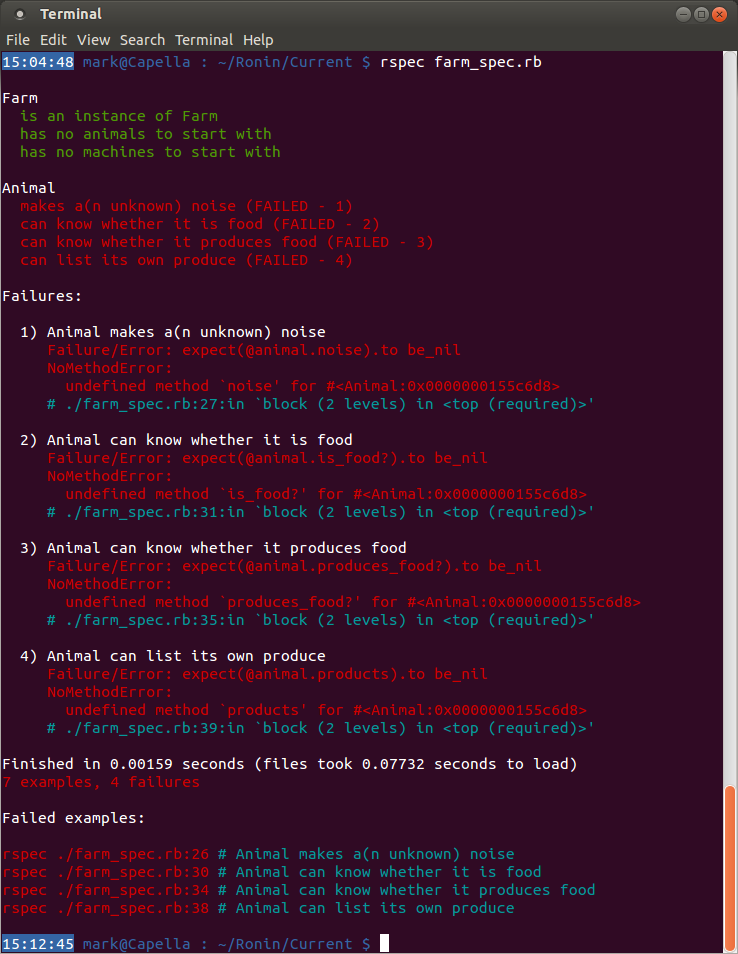

####Adding animals – Step 4####
Right, so now that we have the Farm class tested and working, let’s test that we can create animals to go on our Farm. Remember the criteria we laid out in Step 0?
- animals, which:
  - make a noise
  - declare whether they produce foodstuffs
  - declare whether they themselves are food
  - list the products they can make

So let’s add a test for an Animal class that does all of the above. Remember that this is going to be a generic Animal, so we don’t know at this stage what noise, etc. the animal will make, only that it _can_ make one.

!")

This is a familiar sight now. Can you figure out from the output what is wrong?

Correct! We haven’t declared an Animal class. Head back over to `farm.rb` and add one in:

!")

That’s produced a lot of output! If it’s a little overwhelming, you can run the command `rspec farm_spec.rb --fail-fast`. This will run through the tests and exit as soon as the first test fails, meaning you can take each test one-at-a-time and try to fix them individually.

With regards to the results, it should be obvious by now what is happening. For each test that has failed, the test was expecting that the method (or variable) specified was initialised and contained `nil`. In reality it couldn’t find the variable (as indicated by `NoMethodError: undefined method`). Now you should have enough information to fix the problem. Try it yourself first, but if you’re stuck you can have a look at the solution I suggest. Note that there is more than one way to skin a cat, so if your solution works and is different to that suggested, then great!

!")

!")

Good work!

[← Expanding the Farm tests – Step 3](./writing_tests_step3.md)
